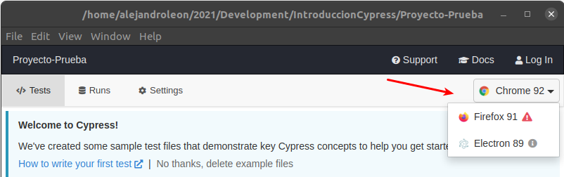

# Browsers.

Cypress por defect ousa Electron como navegador, pero es compatible con otros que usen el proyecto de Chromium.

Automaticamente el cypress detectará los navegadores compatibles en el sistema y podrán seleccionarse del menú desplegable de la parte superior derecha.



También se pueden correr las pruebas seleccionando el nombre del naveagador o indicando la ruta del mismo en el sistema.

```bash
 cypress run --browser {nombre-navegador}
 cypress run --browser /ruta/ejecutable/navegadorx

```
 